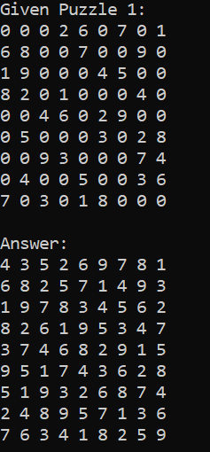
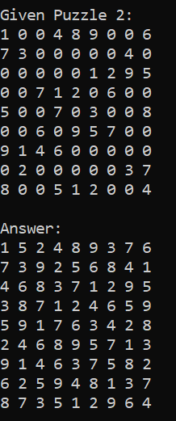

## Simple Sudoku Solver

- solves simple sudoku puzzles
- uses a file reader class to store values in a list then solves the sudoku through recursive backtracking
- writes back to a csv file

## Solution 1
 

## Solution 2
 
